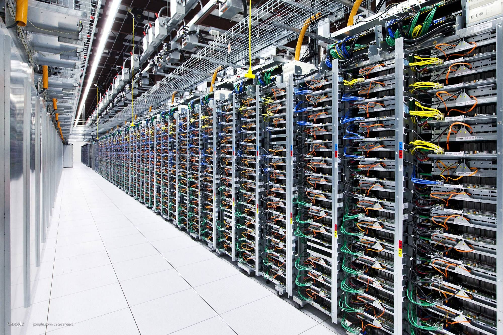
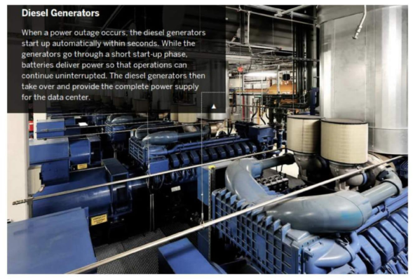
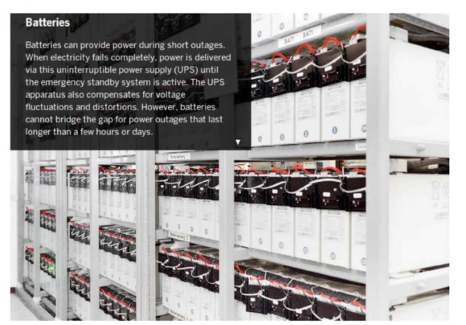
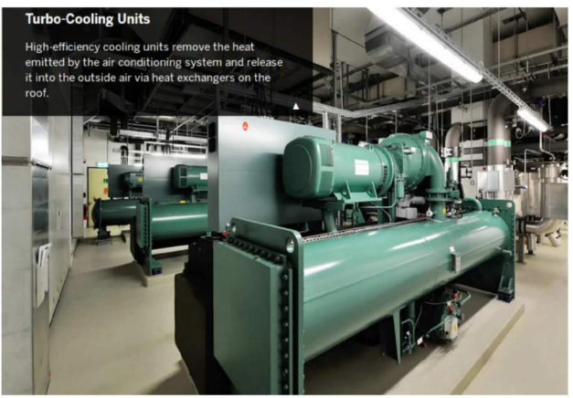
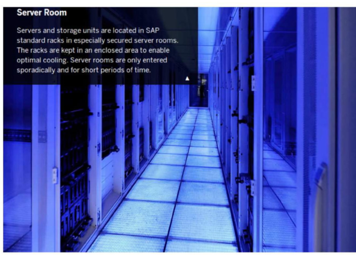

Datacenter
===========

.. image:: images/blankspace.png
     :align: center

**What is Datacenter**

A data center is a facility that centralizes an organization’s shared IT operations and equipment for the purposes of storing, processing, and disseminating data and applications. Because they house an organization's most critical and proprietary assets, data centers are vital to the continuity of daily operations. Consequently, the security and reliability of data centers and their information are among any organization’s top priorities.
In the past, data centers were highly controlled physical infrastructures, but the public cloud has since changed that model. Except where regulatory restrictions require an on-premises data center without internet connections, most modern data center infrastructures have evolved from on-premises physical servers to virtualized infrastructure that supports applications and workloads across multi-cloud environments.

**The Core Components of a Data Center**

Data center architectures and requirements can differ significantly. For example, a data center built for a cloud service provider like Amazon satisfies facility, infrastructure and security requirements that significantly differ from a completely private data center, such as one built for a government facility that is dedicated to securing classified data.

Regardless of classification, an effective data center operation is achieved through a balanced investment in the facility and the equipment it houses. Few core components of Datacenter are given below -

.. image:: images/3tier-02.jpg
    :align: center

References -

https://www.networkworld.com/article/3223692/what-is-a-data-centerhow-its-changed-and-what-you-need-to-know.html

