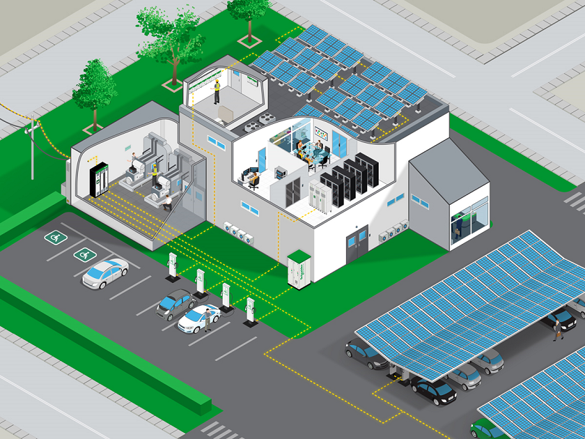

Mutual Goals of Data Centers / Render Farms / Microgreens / Mushroom Farming and Microgrids
===============================================================================================

.. figure:: images/blankspace.png
   :align: center

Sustainability is a concept already embraced by many sectors and is now being progressively adopted by the data center and colocation industry.
The newest microgrid designs are helping data centers & Render Farms /CDN address all three goals, by coordinating a variety of onsite, distributed energy resources (DER), including renewable generation. A microgrid will help optimize costs while also enhancing power stability, includes the option to ‘island’ from the utility grid to avoid exposure to outages or disturbances.

   Microgrids for Datacenters
   [Source - https://blog.se.com/co-location/2020/08/12/microgrids-data-centers-enhancing-uptime-reducing-costs-and-carbon/]

**Why Should Data Center & Render Farm Operators Care About Microgrids?**

- **Power reliability** – Interest in microgrids tends to peak after natural disasters such as a typhoon, especially for areas that are remote from mainland sources of power where a power outage can last for days if not weeks. When the source is disconnected due to a storm, microgrids can pick up the slack, restoring essential power in less time.

- **Lower carbon footprint** – Many hyperscalers are using microgrids to increase their use of renewable sources of energy. Salesforce, for example, has reached its goal of a data center powered by 100% renewable sources.

- **Lower costs** – The ability to choose your power source gives you the control you need to achieve your cost objectives as well.

- **Increase revenues** – A microgrid is no small investment, but that doesn’t necessarily mean it’s only viable for the largest data center operators. Consortiums and partnerships are already being formed where companies and local communities band together to split the costs.
