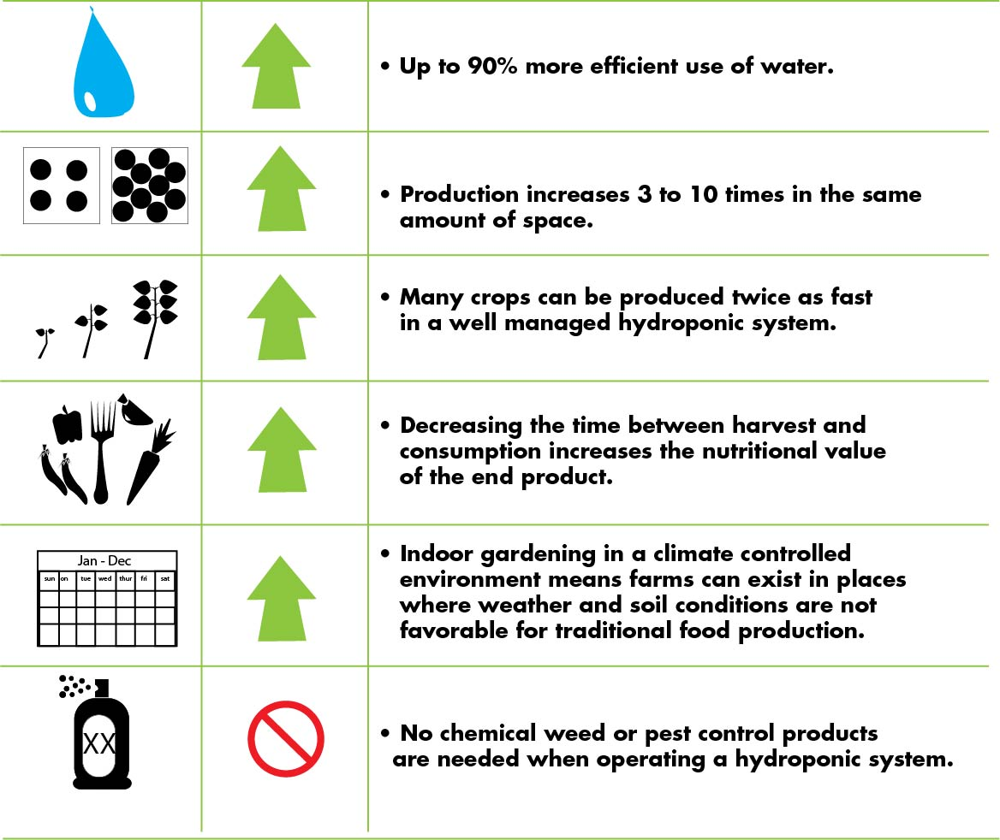
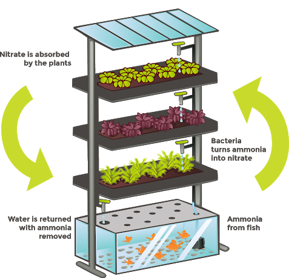

Sustainable Microgreens
========================

.. figure:: images/blankspace.png
   :align: center

Microgreens are more sustainable than crops grown to maturity on large industrial farms that use pesticides and chemicals as inputs, and are often transported hundreds of miles to market.
Growing microgreens is an amazing way to help the planet as well as nourish your body. Because microgreens require way less resources than traditional farming and contain more micronutrients, they’re a great opportunity for alleviating the stress on our overstretched farmlands as well as providing more nutrient-packed full food into our daily lives.

.. figure:: images/microgreens.jpg
   :align: center
   :scale: 60 %

   Fast growing microgreens are popular with five-star chefs who call them “vegetable confetti” and sprinkle them liberally on salads, sandwiches, and plates.

**Urban Farming**
People are starting to understand the value of urban farming–which is growing food wherever possible in cities and in open spaces. That means backyard gardens, gardens instead of lawns, rooftop gardens, indoor farms, and balcony gardens.

Lots of countries–particularly in Africa and Asia–already embrace personal urban farming in high-density cities, but the number of urban commercial farms is also starting to increase. While in many cases, personal gardens are tucked onto balconies and window sills, commercial urban farms are usually hydroponic systems grown in rooftop greenhouses.

Plant factories may be the technology we need to feed a growing and warming planet. The operations, which have no access to natural sunlight and grow plants in vertical rows, are designed to be incredibly efficient. They require 95 percent less water and 99 percent less land than conventional farms, while growing leafy greens with scientific precision without pesticides. Because of their small physical footprint, vertical farms also can produce food close to the urban areas where it will be consumed, reducing the need for transportation and logistics.

**Three reasons microgrids are well suited to meet indoor farming’s blooming energy demands -**

- Microgrids can help grow operations get online faster -
- It’s on brand - On-site electricity generation is kind of like harvesting your own energy to grow your own plants. It’s a technological intermediary between the sun and photosynthesis. Because microgrids can run in island mode, this adds resilience to operations.
- Energy-as-a-service offers price certainty

**Hydroponics**

Hydroponics is the cultivation of plants without using soil. Hydroponic flowers, herbs, and vegetables are planted in inert growing media and supplied with nutrient-rich solutions, oxygen, and water. This system fosters rapid growth, stronger yields, and superior quality. When a plant is grown in soil, its roots are perpetually searching for the necessary nutrition to support the plant. If a plant’s root system is exposed directly to water and nutrition, the plant does not have to exert any energy in sustaining itself. The energy the roots would have expended acquiring food and water can be redirected into the plant’s maturation. As a result, leaf growth flourishes as does the blooming of fruits and flowers.

.. figure:: images/hydroponics.jpg
   :align: center

   Urban Vertical farm implementing Hydroponics

**Benefits of Hydroponics**

**Aquaponics**

Aquaponics is a combination of aquaculture, which is growing fish and other aquatic animals, and hydroponics which is growing plants without soil. Aquaponics uses these two in a symbiotic combination in which plants are fed the aquatic animals’ discharge or waste. In return, the vegetables clean the water that goes back to the fish. Along with the fish and their waste, microbes play an important role to the nutrition of the plants. These beneficial bacteria gather in the spaces between the roots of the plant and converts the fish waste and the solids into substances the plants can use to grow. The result is a perfect collaboration between aquaculture and gardening.

   Aquaponics cycle

.. figure:: images/aqua.jpg
   :align: center

   Aquaponics Implemented in a mall

References -

http://www.freshorigins.com/microgreens-facts/

https://everettclipper.com/13156/showcase/aquaponics-a-solution-for-self-sustainability/