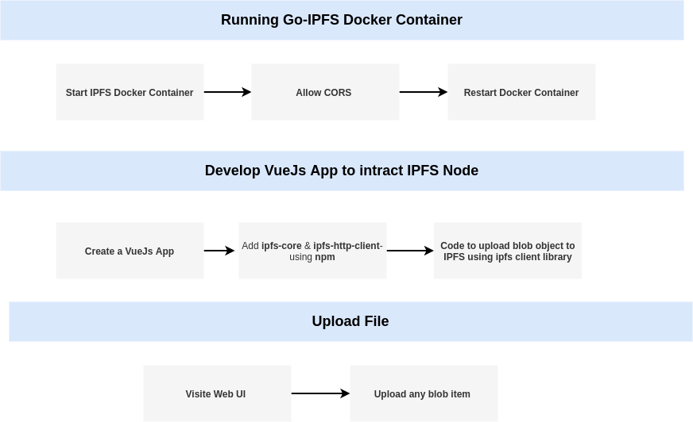

.. image:: images/ipfs_logo.png
    :width: 200
    :align: right

IPFS 
++++++

A peer-to-peer hypermedia protocol designed to make the web faster, safer, and more open.

Use-Case
=============

.. image:: images/ipfsArchitecture.png
    :alt: IPFS Architecture Diagram

Step Flow Diagram
=================

Prerequisites
=============

- Docker
- Npm
- Node
- Vue Cli

Installation
=============

- Create IPFS docker container

    .. code-block:: bash

        docker run -d \
        --name ipfs_host \
        -v ipfs_staging:/export \
        -v ipfs_data:/data/ipfs \
        -p 4001:4001 \
        -p 8080:8080 \
        -p 5001:5001 \
        ipfs/go-ipfs:latest

- Bash into docker container

    .. code-block:: bash

        docker exec -it ipfs_host sh

- Allow CORS

    .. code-block:: bash

        ipfs config Addresses.Gateway /ip4/0.0.0.0/tcp/8080
        ipfs config Addresses.API /ip4/0.0.0.0/tcp/5001
        ipfs config --json API.HTTPHeaders.Access-Control-Allow-Origin "[\"*\"]"
        ipfs config --json API.HTTPHeaders.Access-Control-Allow-Credentials "[\"true\"]"

    
- ``Exit`` and ``Restart`` docker container

    .. code-block:: bash

        docker restart ipfs_host

Getting Started
==================
    
- Create a new Vue app

    .. code-block:: bash

        vue create ipfs-demo

- Add following packages to the project

    - Vuetify

        .. code-block:: bash

            vue add vuetify
    
    - vue-router

        .. code-block:: bash

            vue add router
        
    - ipfs-core and ipfs-http-client

        .. code-block:: bash

            npm install ipfs-core ipfs-http-client

- Clean up the project

    - Delete **components** folder
    - Delete **views** folder contents
    - Clean App.vue file Contents
    - Clear **router/index.js** file Contents
  
- Insert Below code inside ``App.vue``

    .. code-block:: html

        <template>
            <v-app>
                <v-app-bar app
                    color="primary"
                    dark
                    >IPFS Demo</v-app-bar>
                <v-main app>
                    <router-view />
                </v-main>
            </v-app>
        </template>

- Insert below code snippet in ``views/ipfsFileUpload.vue``

.. code-block:: html

        <template>
          <v-container>
            <v-file-input
              v-model="chosenFile"
              dense
              outlined
              label="File input"
            ></v-file-input>
            <v-btn @click="fileUpload">Upload</v-btn>
            <v-dialog v-model="loaderDialog" hide-overlay persistent width="300">
              <v-card color="primary" dark>
                <v-card-text>
                  Please stand by
                  <v-progress-linear
                    :value="progress"
                    indeterminate
                    color="white"
                    class="mb-0"
                  ></v-progress-linear>
                </v-card-text>
              </v-card>
            </v-dialog>
            <v-dialog v-model="resultDialog" hide-overlay persistent width="500">
              <v-card color="primary" class="text-center" dark>
                {{ this.message }}
                 
                <v-btn @click="resultDialog = !resultDialog">Ok</v-btn>
              </v-card>
            </v-dialog>
          </v-container>
        </template>

        

    
    
- Insert below code snippet in ``router/index.js``

    .. code-block:: javascript

        import Vue from 'vue'
        import VueRouter from 'vue-router'

        Vue.use(VueRouter)

        const routes = [
          {
            path: '/',
            redirect : '/ipfs',
          },
          {
            path: '/ipfs',
            name: 'ipfsFileUpload',
            component: () => import('../views/ipfsFileUpload.vue')
          }
        ]

        const router = new VueRouter({
          mode: 'history',
          base: process.env.BASE_URL,
          routes
        })

        export default router

- Start Vue.js app

    .. code-block:: bash

        npm run serve

- View IPFS demo webapp at: ``http://localhost:8081/``.

- Upload file and access via generated URL

