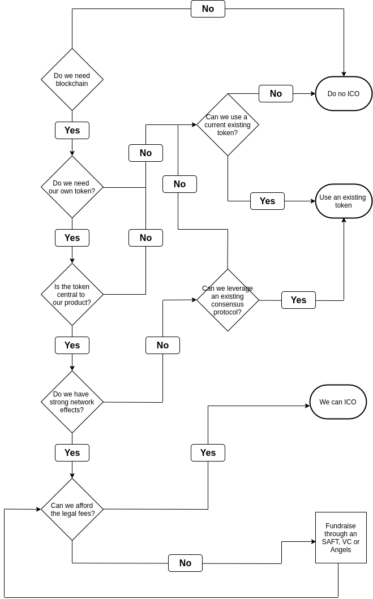

Tokenomics
++++++++++

.. image:: images/blankspace.png
     :align: center

Do we need ICO?
===============

We don't require an ICO.ICO are too much frowned upon as there have been many cons related with them.
We choose primary to not open this kind of worms , and as demonstrated in Cardano initiative , ICO fail to provide long term recurring sustenance for the ecosystem.

Fundraising for creation of platform , demo-site and marketing
Essential Decision : kind of tokens for the platform.

Company's own   Coin token is waste of effort and deviates from primary focus of the platform therefore, we intend to ride on other cryptocurrencies of the world like Bitcoin , ethereum , etc.
Our bias is towards using multiple blockchains , each decision driven  by the sheer suitability.
There will be security token for investments , governance token for voting on the direction of the platform and other decisions; utility tokens for day to day micro-transcations in the ecosystems.

- 1 utility token for energy will be 1 W
- for microgreens and mushrooms will be 100g of produce
- for render farms would be 1 hour of usage

Utility token related Smart contracts in blockchain will enable participants to conduct transactions on the platform without the need for
trust between the counterparties. Tokenization and smart contracts will also eliminate credit risk between counterparties

Next step  is to decide and practical path to making this platform a reality , to to decide seed funding & time required for minimal viable product and then to launch a final battle hardened platform

Then one would like to seek  the funds required for First Demo site .
Next , in pipeline we can imagine Marketing funds .

Somewhere in there one would be performing Analysis of Risks ,  volatility and selection of relevant team members .

All unsold Aliyda Utility Tokens will be burned, Aliyda token is burnable
and non-mintable. That imply that Aliyda can decide to reduce the amount of
token created by burning an agreed number. The token is non-mintable means
the token is only created at one time. No more token will ever be created again.

+------------------+---------------------------+
| Token Name       |                           |
+------------------+---------------------------+
| Token Symbol     |                           |
+------------------+---------------------------+
| Platform         |                           |
+------------------+---------------------------+
| Type             |                           |
+------------------+---------------------------+
| Total Supply     |                           |
+------------------+---------------------------+
| Token Price      |                           |
+------------------+---------------------------+
| Token to be sold |                           |
+------------------+---------------------------+
| Soft Cap         |                           |
+------------------+---------------------------+
| Hard cap         |                           |
+------------------+---------------------------+
| New Hard cap     |                           |
+------------------+---------------------------+

Token Buy Back
==============

Aliyda may set out 20% of the profit made to buy back tokens from holders
till the circulating supply becomes 300 million. This would be done quarterly.
The concept of buying back and burning will add to the value of the token.

Token Distribution
==================

+------------------+----------------------+
| For ICO Sale     |                      |
+------------------+----------------------+
| Advisory Service |                      |
+------------------+----------------------+
| Marketing Spend  |                      |
+------------------+----------------------+
| Bonus            |                      |
+------------------+----------------------+
| Bounty           |                      |
+------------------+----------------------+
| Airdrop          |                      |
+------------------+----------------------+
| Partnerships     |                      |
+------------------+----------------------+
| Reserve          |                      |
+------------------+----------------------+
| Founding Team    |                      |
+------------------+----------------------+

.. image:: images/pieChart1.png
     :align: center

**USE OF PROCEEDS**

The funds raised from the token sale will be used to fulfill the development
milestone.

+-----------------+----------------------+
| Development     |                      |
+-----------------+----------------------+
| Operation       |                      |
+-----------------+----------------------+
| Licensing       |                      |
+-----------------+----------------------+
| Marketing       |                      |
+-----------------+----------------------+
| Reserve Capital |                      |
+-----------------+----------------------+

.. image:: images/pieChart2.png
     :align: center

Volatility
==============

Aliyda team will work overtime to ensure that the Aliyda utility tokens maintains better
stability and are protected against unhealthy fluctuations. This would be done by:

* Sharing realistic, transparent and credible project document and information
  for fair valuation,

* Attempting to reduce differences between exchanges,

* Working continuously against unhealthy rumours and unwanted information
  spreading,

* Investors and buyers will be encouraged to stay invested and look for long-
  term growth opportunity and greater return.

The above will also facilitate to gain long-term success for Aliyda utility token.

References -

https://www.solarex.io/assets/files/Solarex_Whitepaper_V1.pdf (Section 8.0)

.. note::
    The tables are hypothetical placed them here as placeholders